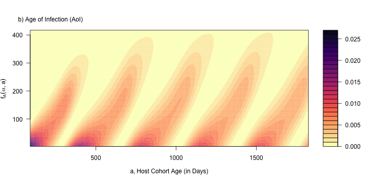

***

[Home](Memory.html) | 
[Fig 3](Figure3.html) |
[Fig 5](Figure5.html) |
[Fig 6](Figure6.html) |
[Fig 7](Figure7.html) |
[Fig 8](Figure8.html) |
[Fig 9](Figure9.html) |
[Fig 10](Figure10.html)

*** 

# {.tabset}

## $\odot$ 





## Setup

```{r}
library(ramp.falciparum)
library(viridisLite)
library(knitr)
```

```{r}
foiP3 = list(hbar = 1, 
             agePar = par_type2Age(), 
             seasonPar = par_sinSeason(), 
             trendPar = par_flatTrend())
```


## Figure 4a 

```{r MoIsurface}
MoIsurface = function(h = 10/365, FoIpar=foiP3, r=1/200, tau=0, 
                      Tmax = 5*365, alphaMax = 500, dt=5)
{ 
  zeta = seq(0, 12, by=1) 
  a = seq(90, Tmax, by=dt) 
  mesh = outer(zeta, a)
  moi = mesh*0
  
  for(j in 1:length(a)){
    m = meanMoI(a[j], FoIpar, tau, h, r)
    moi[,j] = dpois(zeta, m) 
  } 
  
  list(moi=t(moi), x=a, y=zeta)
}
```

```{r}
moiObj = MoIsurface()
```


```{r}
Figure4a = function(moiObj){
  nclrs = 25
  clrs = rev(magma(nclrs))
  
  with(moiObj, filled.contour(x, y, moi, 
                              xlab = expression(list(a, "Host Cohort Age (in Days)")), 
                              ylab = expression(f[M](zeta, a)), 
                              xaxt = "n", 
                              yaxt = "n", 
                              nlevels=nclrs, 
                              col = clrs)) 
  
  
  mtext("a) Multiplicity of Infection (MoI)", 3, 1, at = 220, cex=1)
}
Figure4a(moiObj)
```
```{r}
png("Figure4a.png", height= 360, width = 720)
Figure4a(moiObj)
invisible(dev.off(dev.cur()))
```

## Figure 4b 

```{r}
AoIsurface = function(h=10/365, FoIpar=foiP3, r=1/200, tau=0, 
                      Tmax=5*365, alphaMax = 420, dt=5){ 
  alpha = seq(2, alphaMax, by=dt) 
  a = seq(90,Tmax, by=dt) 
  mesh = outer(alpha, a)
  ages = mesh*0
  
  for(j in 1:length(a)){
    ix = which(alpha <= a[j])
    ages[ix,j] = dAoI(alpha[ix], a[j], FoIpar=FoIpar,hhat=h,r=r,tau=tau)
  } 

  list(aoi=t(ages), x=a, y=alpha)
}
```

```{r}
aoiObj = AoIsurface() 
```

```{r}
Figure4b = function(aoiObj){
  nclrs = 29 
  clrs = rev(magma(nclrs))
  
  with(aoiObj, filled.contour(x, y, aoi, 
                              xlab = expression(list(a, "Host Cohort Age (in Days)")), 
                              ylab = expression(f[A](alpha, a)), 
                              xaxt = "n", 
                              yaxt = "n", 
                              nlevels=nclrs, 
                              col = clrs)) 
  
  
  mtext("b) Age of Infection (AoI)", 3, 1, at=172, cex=1)
}
Figure4b(aoiObj)
```

```{r}
png("Figure4b.png", height= 360, width = 720)
Figure4b(aoiObj)
invisible(dev.off(dev.cur()))
```

## Figure 4c


```{r}


AoYsurface = function(h=10/365, FoIpar=foiP3, r=1/200, tau=0, 
                      Tmax=5*365, alphaMax = 420, dt=5){ 
  alpha = seq(2, alphaMax, by=dt) 
  a = seq(90,Tmax, by=dt) 
  mesh = outer(alpha, a)
  ages = mesh*0
  
  for(j in 1:length(a)){
    ix = which(alpha <= a[j])
    ages[ix,j] = dAoY(alpha[ix], a[j], FoIpar=FoIpar,hhat=h,r=r,tau=tau)
  } 
  
  list(aoy=t(ages), x=a, y=alpha)
}
```


```{r}
aoyObj = AoYsurface()
```


```{r}
Figure4c = function(aoYobj){
  nclrs = 29 
  clrs = rev(magma(nclrs))
  
  with(aoyObj, filled.contour(x, y, aoy, 
                              xlab = expression(list(a, "Host Cohort Age (in Days)")), 
                              ylab = expression(f[Y](alpha, a)), 
                              xaxt = "n", 
                              yaxt = "n", 
                              nlevels=nclrs, 
                              col = clrs))
  
  mtext("c) Age of the Youngest Infection (AoY)", 3, 1, at=280, cex=1)
}
Figure4c(aoyObj)
```

```{r}
png("Figure4c.png", height= 360, width = 720)
Figure4c(aoyObj)
invisible(dev.off(dev.cur()))
```

## Remake

To remake Figure 4, first run this purl script to make `Figure4.R` 

```{r purl Figure 4, purl=F, eval = FALSE}
purl("Figure4.Rmd", "Figure4.R")
```

then source `Figure4.R` 

```{r Fig4, purl=F, eval = FALSE}
source("Figure4.R")
```