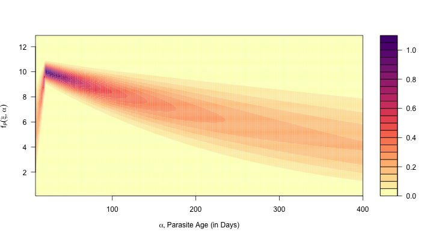

***

[Home](Memory.html) | 
[Fig 3](Figure3.html) |
[Fig 4](Figure4.html) |
[Fig 6](Figure6.html) |
[Fig 7](Figure7.html) |
[Fig 8](Figure8.html) |
[Fig 9](Figure9.html) |
[Fig 10](Figure10.html)

*** 

# {.tabset}

## $\odot$ 

Figure 5 illustrates the MLE fits: 

[mle.Rmd](mle.html)



## Setup


```{r}
library(ramp.falciparum)
library(viridisLite)
library(knitr)
```

## Fig 5

```{r}
alpha2PD = function(r=1/200, tau=0, Tmax=5*365, dt=1){
  alpha = seq(8, 400, by=2) 
  Bmesh = seq(0.1, 12.9, by=0.1)
  mesh = outer(Bmesh, alpha)*0
  for(j in 1:length(alpha)){
    pd = d_alpha2density(Bmesh, alpha[j], r, parD) 
    mesh[,j] = pd
  }
  mesh 
  list(pd=t(mesh), x=alpha, y=Bmesh)
}
```


```{r}
pdObj = alpha2PD()
```


```{r}
nclrs = 29 
clrs = rev(magma(nclrs))

with(pdObj, filled.contour(x, y, pd, 
                           xlab = expression(list(alpha, "Parasite Age (in Days)")), 
                           ylab = expression(f[P](xi, alpha)), 
                           xaxt = "n", 
                           yaxt = "n", 
                           nlevels=nclrs, 
                           col = clrs))

```

## Remake

```{r make Figure5.R, purl=F, eval=FALSE}
purl("Figure5.Rmd", "Figure5.R")
```


```{r source Figure5.R, purl=F, eval=FALSE}
png("Figure5.png", height= 400, width = 720)
source("Figure5.R")
invisible(dev.off(dev.cur()))
```