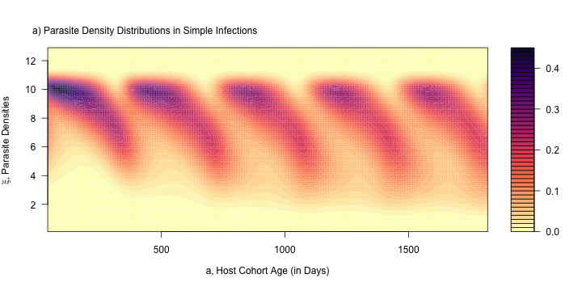
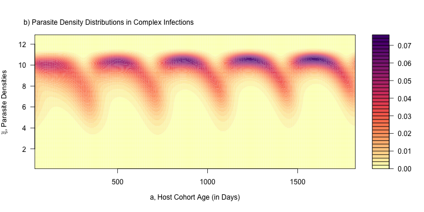

***

[Home](Memory.html) | 
[Fig 3](Figure3.html) |
[Fig 4](Figure4.html) |
[Fig 5](Figure5.html) |
[Fig 6](Figure6.html) |
[Fig 8](Figure8.html) |
[Fig 9](Figure9.html) |
[Fig 10](Figure10.html)

*** 

# {.tabset}

## $\odot$





## Setup 

```{r}
library(ramp.falciparum)
library(viridisLite)
library(knitr)
```

```{r, eval=F}
purl("Figure7.Rmd", "Figure7.R")
```

```{r}
foiP3 = list(hbar = 1, 
             agePar = par_type2Age(), 
             seasonPar = par_sinSeason(), 
             trendPar = par_flatTrend())
```

## Fig 7a


```{r}
Psimple = function(h=10/365,  FoIpar=foiP3, r=1/200, tau=0, 
                   Tmax=5*365, alphaMax = 420, dt=5){
  a = seq(40, Tmax, by=10) 
  Bmesh = seq(.1, 12.9, by = 0.1)
  mesh = outer(Bmesh, a)
  ages = mesh*0
  for(j in 1:length(a)){
    ages[,j] = d_clone_density(Bmesh,a[j], FoIpar=FoIpar, hhat=h, r=r, tau=tau)
  }
  
  list(pd = t(ages), x=a, y=Bmesh)
}
```


```{r}
Psimple() -> simpleP
```


```{r}
Figure7a = function(simpleP){
  nclrs = 50 
  clrs = rev(magma(50))

  with(simpleP, filled.contour(x, y, pd, 
                             xlab = expression(list(a, "Host Cohort Age (in Days)")), 
                             ylab = expression(list(xi, paste("Parasite Densities"))), 
                             xaxt = "n", 
                             yaxt = "n", 
                             nlevels=nclrs, 
                             col = clrs)) 

  mtext("a) Parasite Density Distributions in Simple Infections", 3, 1, at=350)
}
Figure7a(simpleP)
```

```{r}
png("Figure7a.png", height= 360, width = 720)
Figure7a(simpleP)
invisible(dev.off(dev.cur()))
```

## Fig 7b

```{r}
Pcomplex = function(h=10/365,  FoIpar=foiP3, r=1/200, tau=0, 
                    Tmax=5*365, alphaMax = 420, dt=5){
  a = seq(40, Tmax, by=10) 
  Bmesh = seq(.1, 12.9, by = 0.1)
  mesh = outer(Bmesh, a)
  ages = mesh*0
  for(j in 1:length(a)){
    ages[,j] = d_parasite_density(Bmesh,a[j], FoIpar=FoIpar, hhat=h, r=r, tau=tau)
  }
  
  list(pd = t(ages), x=a, y=Bmesh)
}
```


```{r}
Pcomplex() -> complexP
```


```{r}
Figure7b = function(complexP){
nclrs = 50 
clrs = rev(magma(50))

with(complexP, filled.contour(x, y, pd, 
                              xlab = expression(list(a, "Host Cohort Age (in Days)")), 
                              ylab = expression(list(xi, paste("Parasite Densities"))), 
                              xaxt = "n", 
                              yaxt = "n", 
                              nlevels=nclrs, 
                              col = clrs)) 

mtext("b) Parasite Density Distributions in Complex Infections", 3, 1, at=365)
}
Figure7b(complexP)
```

```{r}
png("Figure7b.png", height= 360, width = 720)
Figure7b(complexP)
invisible(dev.off(dev.cur()))
```

## Fig 7c

```{r}
CountsSurface = function(dBobj, par=par_nb()){
  surf=dBobj$pd
  a = dBobj$x 
  meshX = dBobj$y 
  bins = c(log10(1:9), seq(1, 5, length.out=30)) 
  counts= outer(a, bins)*0
  for(i in 1:length(a)){
    for(j in 1:length(meshX)){
      Bx = surf[i,j]
      cnts = d_nz_counts_log_binned(meshX[j], bins, 13, par)
      counts[i,]= counts[i,] + Bx*cnts
    } 
  }
  list(counts=counts, x=a, y=bins) 
}
```


```{r}
countsSurf = CountsSurface(complexP)
```


```{r}
Figure7c = function(countsSurf){
  nclrs = 41 
  clrs = rev(magma(nclrs))

  with(countsSurf, filled.contour(x, y, counts, 
                                xlab = expression(list(a, "Host Cohort Age (in Days)")), 
                                ylab = expression(list(hat(xi), log[10](paste("Parasite Counts")))), 
                                xaxt = "n", 
                                yaxt = "n", 
                                nlevels=nclrs, 
                                col = clrs)) 

  mtext("c) Parasite counts", 3, 1, at=100)
}
Figure7c(countsSurf)
```

```{r}
png("Figure7c.png", height= 360, width = 720)
Figure7c(countsSurf)
invisible(dev.off(dev.cur()))
```

## Remake

To remake Figure 7, first run this purl script to make Figure7.R

```{r, purl=F, eval=F}
purl("Figure7.Rmd", "Figure7.R")
```
then source Figure7.R

```{r, purl=F, eval=F}
source("Figure7.R")
```