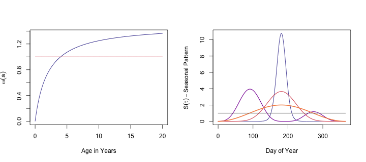
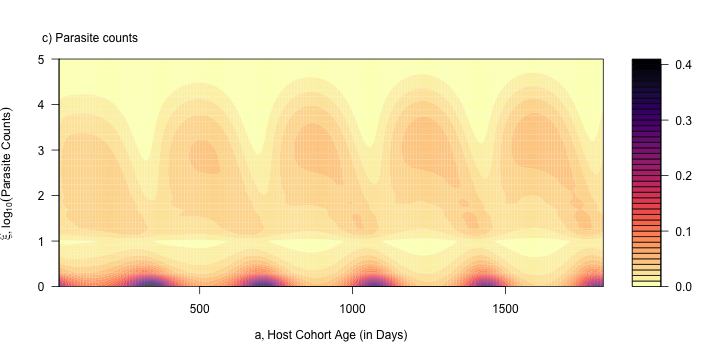

*** 

[Fig 3](Figure3.html) |
[Fig 4](Figure4.html) |
[Fig 5](Figure5.html) |
[Fig 6](Figure6.html) |
[Fig 7](Figure7.html) |
[Fig 8](Figure8.html) |
[Fig 9](Figure9.html) | 
[Fig 10](Figure10.html)

*** 

# {.tabset}

## $\odot$ 

This depends on the R package `ramp.falciparum,`
which is available from github. The following code will install it:

```{r, eval=FALSE}
devtools::install_github("dd-harp/ramp.falciparum")
install.packages("ramp.falciparum")
```

Each figure is created by it's own R markdown file. To regenerate, set `remakeFigs==TRUE` in the header above and source this file. This remakes the R code using `purl,`  then sources the R code to make the final version of each figure. 

```{r}
library(knitr)
library(viridis)
```


## Fig 1

Latex code generates Figure 1:

\begin{equation*}
\begin{array}{c}
\begin{array}{ccccccccc}
\zeta_0 &  {h\atop \longrightarrow} \atop {\longleftarrow \atop r} & \zeta_1  & {h\atop \longrightarrow} \atop {\longleftarrow \atop {2r}} & \zeta_2  & {h \atop \longrightarrow} \atop {\longleftarrow \atop {3r}} & \zeta_3  & {h \atop \longrightarrow} \atop {\longleftarrow \atop {4r}}& \ldots 
\end{array} 
\\ 
\\ 
\begin{array}{rl}
d\zeta_0/dt &= -h \zeta_0 + r \zeta_1 \\ 
d \zeta_i /dt &= -(h+r) \zeta_i + h \zeta_{i-1} + r(i+1) \zeta_{i+1} \\
\end{array} 
\end{array}
\end{equation*}

## Fig 2 

Figure 2 was generated using drawIO from "Figure2.drawio"


## Fig 3 

see [Figure3.Rmd](Figure3.html)

```{r, eval=F}
purl("Figure3.Rmd", "Figure3.R")
png("Figure3.png", height= 320, width = 720)
par(mfrow = c(1,2))
source("Figure3.R")
invisible(dev.off(dev.cur()))
```




## Fig 4 

+ [Figure4.Rmd](Figure4.html)

```{r Fig4, eval = params$remakeFigs}
purl("Figure4.Rmd", "Figure4.R")
png("Figure4a.png", height= 1080, width = 720)
source("Figure4.R")
invisible(dev.off(dev.cur()))
```

***


***


## Fig 5


+ [Figure5.Rmd](Figure5.html)

```{r Fig5, eval= params$remakeFigs}
purl("Figure5.Rmd", "Figure5.R")
png("Figure5.png", height= 400, width = 720)
source("Figure5.R")
invisible(dev.off(dev.cur()))
```

*** 


## Fig 6

+ [Figure6.Rmd](Figure6.html)

```{r Fig6, eval= params$remakeFigs}
purl("Figure6.Rmd", "Figure6.R")
png("Figure6.png", height=840, width=560)
par(mfrow = c(3,1))
source("Figure6.R")
invisible(dev.off(dev.cur()))
```
*** 


## Fig 7

+ [Figure7.Rmd](Figure7.html)

```{r Fig7, eval= params$remakeFigs}
purl("Figure7.Rmd", "Figure7.R")
png("Figure7.png", height=1080, width=560)
par(mfrow = c(3,1))
source("Figure7.R")
invisible(dev.off(dev.cur()))
```
*** 


*** 




## Fig 8

+ [Figure8.Rmd](Figure8.html)

```{r Fig8, eval= params$remakeFigs}
purl("Figure8.Rmd", "Figure8.R")
png("Figure8.png", height=360, width=720)
source("Figure8.R")
invisible(dev.off(dev.cur()))
```
*** 


## Fig 9 

+ [Figure9.Rmd](Figure9.html)

```{r Fig9, eval= params$remakeFigs}
purl("Figure9.Rmd", "Figure9.R")
png("Figure9.png", height=720, width=720)
par(mfrow = c(2,1))
source("Figure9.R")
invisible(dev.off(dev.cur()))
```

***


*** 


## Fig 10  

+ [Figure10.Rmd](Figure10.html)


```{r Fig10, eval= params$remakeFigs}
purl("Figure10.Rmd", "Figure10.R")
png("Figure10.png", height=360, width=720)
source("Figure10.R")
invisible(dev.off(dev.cur()))
```

*** 

